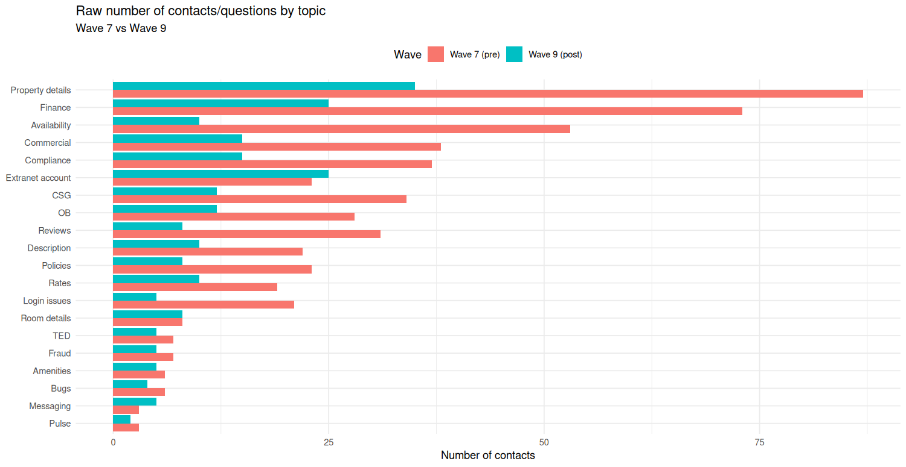
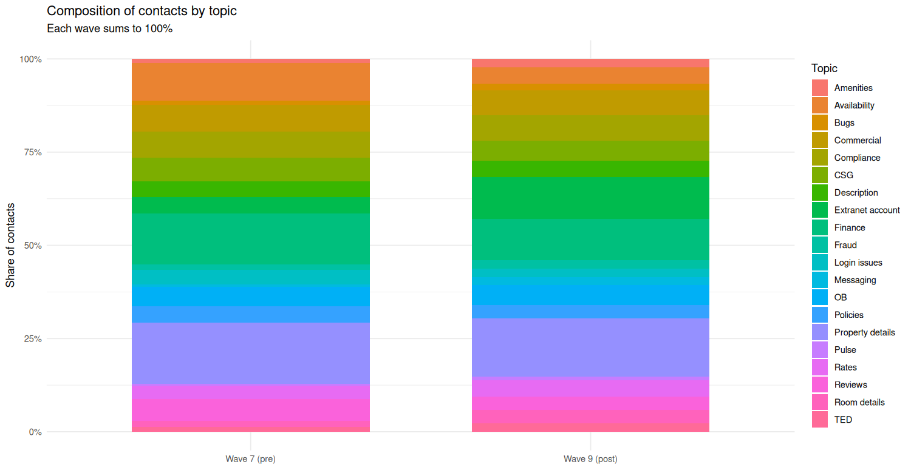
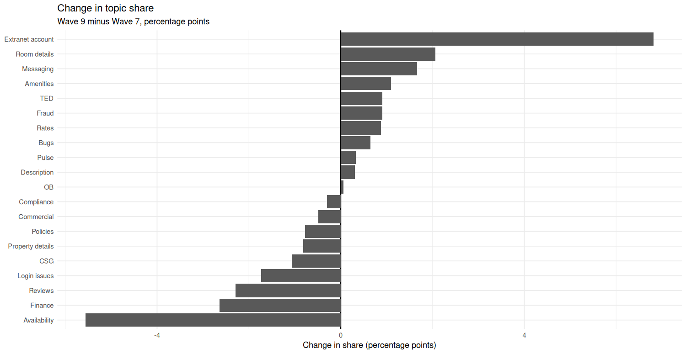
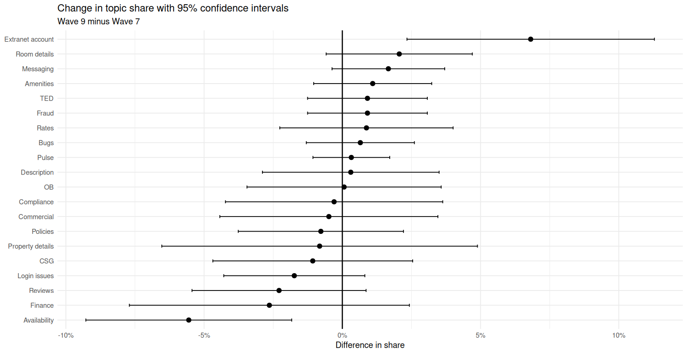
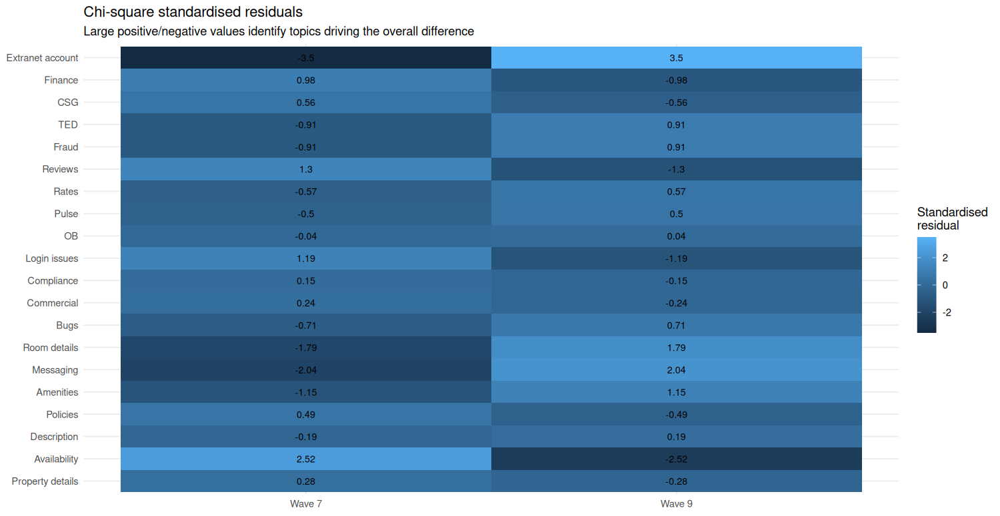
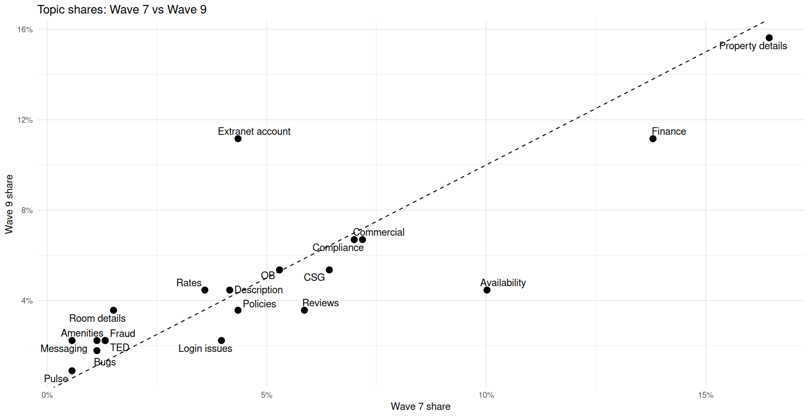

DMAIC project, Quality Analyst role.

> **Disclaimer:** This was a real project, but the dataset here (counts, waves, stats) is synthetic — built to match the structure of the original analysis without exposing company data. Methodology and general findings reflect the real project; exact numbers don't.

## Background

New hires generate a spike of support questions in the weeks right after training ("nesting"). Each question costs coach time and slows the new hire down. I wanted to know whether these questions were concentrated in a few topics or spread evenly — and if concentrated, whether a short pre-nesting quiz could reduce them.

## Method (DMAIC)

- **Define:** find the topics driving the most nesting questions, build an intervention, measure if it works.
- **Measure:** logged 529 questions (Wave 7, baseline) and 224 questions (Wave 9, post-intervention) across 20 topics. Top 5 Wave 7 topics (Property details, Finance, Availability, Commercial, Compliance) made up 58% of all questions — enough concentration to justify a targeted fix.
- **Analyze:** chi-square test on the full topic × wave table, plus per-topic two-proportion tests with Benjamini–Hochberg correction (needed since 20 topics were tested at once).
- **Improve:** built a short quiz covering the top-volume topics, distributed before Wave 9 started nesting.
- **Control:** compared Wave 7 vs Wave 9 with the same taxonomy and process to see what actually moved.

## Results

Overall topic mix changed significantly between waves (χ² = 33.0, df = 19, p = 0.024, Cramér's V = 0.21).

Per-topic, after BH correction for 20 comparisons, only one topic held up:

| Topic | Δ share (pp) | Share ratio | p (BH-adjusted) | Significant |
|---|---|---|---|---|
| Extranet account | +6.8 | 2.57× | 0.009 | Yes |
| Availability | −5.6 | 0.45× | 0.119 | No |
| Property details | −0.8 | 0.95× | 0.929 | No |
| Finance | −2.6 | 0.81× | 0.725 | No |

Full per-topic table in [`Wave7_Wave9_topic_tests.csv`](Wave7_Wave9_topic_tests.csv).

**Extranet account** rose from 4.4% to 11.2% of all questions and wasn't a quiz topic — a genuine new gap, not something the quiz caused.

**Availability** had the largest raw drop (53 → 10 questions) and was the quiz's main target, but the effect doesn't survive multiple-comparison correction at this sample size. It's a strong directional result, not a confirmed one — Wave 9's n = 224 likely wasn't large enough to detect an effect this size at significance. Worth re-testing with a bigger sample before calling it a win.

Property details and Finance, the two biggest baseline topics, moved in the right direction but not significantly. A few low-volume topics look like they grew in share, but their raw counts barely changed — mostly an artifact of Availability's big drop shrinking the denominator.

## Charts

| | |
|---|---|
|  Raw counts by topic |  Topic composition, each wave |
|  Change in share (pp) |  Change with 95% CI |
|  Chi-square residuals |  Wave 7 vs Wave 9 share |

Full chart set in [`images/`](images/).

## Recommendations

- Add Extranet account to the quiz — the one statistically confirmed gap.
- Keep Availability in the quiz, but don't close the loop on it yet — re-measure with a larger next cohort before calling it resolved.
- Leave the small movers alone unless raw counts start climbing, not just share.
- Size the next measurement wave with enough sample to actually detect an effect Availability's size, not just repeat an inconclusive test.

## Limitations

Before/after comparison, not randomized — can't fully rule out other factors changing between waves. Wave 9's smaller sample limits power to detect real effects, which is the main open question this project leaves behind.

## Files

- `README.md` — this file
- `images/` — charts
- `Wave7_Wave9_topic_descriptive_results.csv`, `Wave7_Wave9_topic_tests.csv`, `Wave7_Wave9_change_confidence_intervals.csv` — analysis outputs
- Analysis in R (`tidyverse`, `broom`, `scales`, `patchwork`, `ggrepel`)
